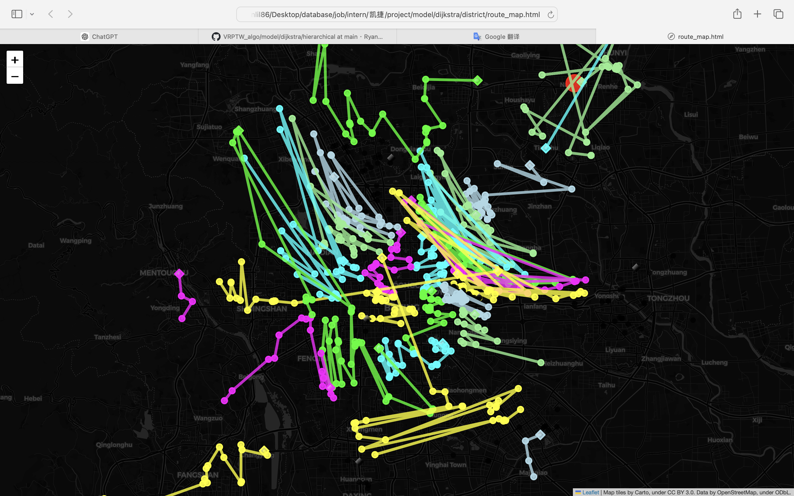

# beijing712.txt report - VRPTW_dijkstra model

This report summarizes the weight and volume utilization for a fleet of cars, along with other relevant statistics.

## Summary of Utilization

**Total Orders Count:** 713

### Utilization by Car

| Car Number | Weight Utilization (%) | Volume Utilization (%) |
|------------|------------------------|------------------------|
| Car 1      | 97.96                  | 77.92                  |
| Car 2      | 78.73                  | 62.63                  |
| Car 3      | 99.14                  | 78.86                  |
| Car 4      | 94.46                  | 75.13                  |
| Car 5      | 29.61                  | 23.55                  |
| Car 6      | 98.46                  | 78.32                  |
| Car 7      | 99.84                  | 79.41                  |
| Car 8      | 99.10                  | 78.83                  |
| Car 9      | 99.99                  | 79.54                  |
| Car 10     | 97.69                  | 77.71                  |
| Car 11     | 99.73                  | 79.33                  |
| Car 12     | 98.95                  | 78.71                  |
| Car 13     | 96.24                  | 76.56                  |
| Car 14     | 63.81                  | 50.76                  |
| Car 15     | 97.69                  | 77.71                  |
| Car 16     | 98.89                  | 78.66                  |
| Car 17     | 55.84                  | 44.42                  |
| Car 18     | 59.67                  | 47.47                  |
| Car 19     | 97.92                  | 77.89                  |
| Car 20     | 99.81                  | 79.39                  |
| Car 21     | 99.89                  | 79.46                  |
| Car 22     | 97.90                  | 77.88                  |
| Car 23     | 42.73                  | 33.99                  |
| Car 24     | 16.01                  | 12.73                  |
| Car 25     | 61.82                  | 49.18                  |
| Car 26     | 99.61                  | 79.24                  |
| Car 27     | 12.77                  | 10.16                  |
| Car 28     | 95.08                  | 75.63                  |
| Car 29     | 11.50                  | 9.15                   |
| Car 30     | 96.47                  | 76.74                  |
| Car 31     | 10.01                  | 7.96                   |
| Car 32     | 99.23                  | 78.93                  |
| Car 33     | 81.04                  | 64.46                  |
| Car 34     | 18.48                  | 14.70                  |
| Car 35     | 16.44                  | 13.08                  |
| Car 36     | 10.15                  | 8.07                   |
| Car 37     | 8.70                   | 6.92                   |

### Averages

- **Average Weight Utilization:** 71.00%
- **Average Volume Utilization:** 57.00%

### Additional Information

- **Total Distance for `beijing712.txt`:** 8018.72 km
- **Total Number of Cars Used:** 37
- **Classification mode:** Classify data by district

## Image

<!--  -->
