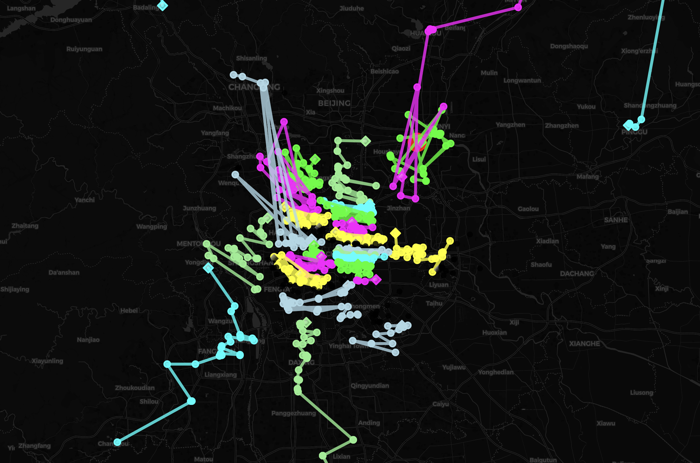

# Report - dijkstra_VRPTW_hierarchical model

This report summarizes the weight and volume utilization for a fleet of cars, along with other relevant statistics.

## Summary of Utilization

### File: beijing712.txt

**Total Orders Count:** 713

### Utilization by Car

| Car Number | Weight Utilization (%) | Volume Utilization (%) |
|------------|------------------------|------------------------|
| Car 1      | 8.70                   | 6.92                   |
| Car 2      | 99.77                  | 79.36                  |
| Car 3      | 97.88                  | 77.86                  |
| Car 4      | 96.30                  | 76.60                  |
| Car 5      | 98.17                  | 78.09                  |
| Car 6      | 88.72                  | 70.57                  |
| Car 7      | 99.49                  | 79.14                  |
| Car 8      | 77.56                  | 61.70                  |
| Car 9      | 96.95                  | 77.12                  |
| Car 10     | 97.69                  | 77.71                  |
| Car 11     | 98.06                  | 78.00                  |
| Car 12     | 98.12                  | 78.05                  |
| Car 13     | 94.45                  | 75.13                  |
| Car 14     | 98.99                  | 78.74                  |
| Car 15     | 20.26                  | 16.12                  |
| Car 16     | 95.08                  | 75.63                  |
| Car 17     | 47.59                  | 37.86                  |
| Car 18     | 99.19                  | 78.90                  |
| Car 19     | 98.59                  | 78.43                  |
| Car 20     | 42.65                  | 33.93                  |
| Car 21     | 98.59                  | 78.42                  |
| Car 22     | 99.82                  | 79.40                  |
| Car 23     | 93.38                  | 74.28                  |
| Car 24     | 94.22                  | 74.95                  |
| Car 25     | 98.55                  | 78.39                  |
| Car 26     | 97.55                  | 77.60                  |
| Car 27     | 96.68                  | 76.91                  |
| Car 28     | 97.19                  | 77.31                  |
| Car 29     | 97.07                  | 77.22                  |
| Car 30     | 98.56                  | 78.40                  |
| Car 31     | 15.57                  | 12.39                  |

### Averages

- **Average Weight Utilization:** 85.00%
- **Average Volume Utilization:** 68.00%

### Additional Information

- **Total Distance for `beijing712.txt`:** 10058.89 km
- **Total Number of Cars Used:** 31
- **Total Number of Single Vertex:** 0
- **Classification Mode:** Classify data by Agglomerative hierarchical clustering

## Image

---

### File: jinan151.txt

**Total Orders Count:** 151

### Utilization by Car

| Car Number | Weight Utilization (%) | Volume Utilization (%) |
|------------|------------------------|------------------------|
| Car 1      | 33.08                  | 15.50                  |
| Car 2      | 97.76                  | 35.23                  |
| Car 3      | 38.24                  | 14.39                  |
| Car 4      | 98.96                  | 35.31                  |
| Car 5      | 98.20                  | 37.02                  |
| Car 6      | 98.84                  | 35.45                  |
| Car 7      | 95.48                  | 34.81                  |
| Car 8      | 97.00                  | 35.13                  |
| Car 9      | 98.28                  | 36.09                  |
| Car 10     | 37.44                  | 13.46                  |
| Car 11     | 57.04                  | 18.90                  |

### Averages

- **Average Weight Utilization:** 77.00%
- **Average Volume Utilization:** 28.00%

### Additional Information

- **Total Distance for `jinan151.txt`:** 1959.92 km
- **Total Number of Cars Used:** 11
- **Total Number of Single Vertex:** 0
- **Classification Mode:** Classify data by Agglomerative hierarchical clustering

## Image

---

### File: shanghai1033_west761.txt

**Total Orders Count:** 761

### Utilization by Car

| Car Number | Weight Utilization (%) | Volume Utilization (%) |
|------------|------------------------|------------------------|
| Car 1      | 94.40                  | 49.01                  |
| Car 2      | 96.23                  | 55.58                  |
| Car 3      | 98.07                  | 57.49                  |
| Car 4      | 62.57                  | 35.29                  |
| Car 5      | 96.63                  | 53.58                  |
| Car 6      | 88.67                  | 46.96                  |
| Car 7      | 13.73                  | 5.88                   |
| Car 8      | 91.00                  | 57.85                  |
| Car 9      | 98.33                  | 59.03                  |
| Car 10     | 95.00                  | 54.39                  |
| Car 11     | 89.17                  | 52.48                  |
| Car 12     | 94.87                  | 53.22                  |
| Car 13     | 40.97                  | 22.51                  |
| Car 14     | 94.63                  | 57.11                  |
| Car 15     | 91.03                  | 56.86                  |
| Car 16     | 92.37                  | 48.93                  |
| Car 17     | 90.00                  | 55.84                  |
| Car 18     | 95.97                  | 54.92                  |
| Car 19     | 96.57                  | 58.03                  |
| Car 20     | 93.77                  | 49.12                  |
| Car 21     | 95.53                  | 55.24                  |
| Car 22     | 99.47                  | 55.87                  |
| Car 23     | 66.33                  | 49.14                  |
| Car 24     | 59.80                  | 32.08                  |
| Car 25     | 95.83                  | 56.93                  |
| Car 26     | 92.60                  | 48.87                  |
| Car 27     | 99.77                  | 55.40                  |
| Car 28     | 84.63                  | 64.75                  |
| Car 29     | 92.60                  | 72.37                  |
| Car 30     | 37.57                  | 19.29                  |
| Car 31     | 74.20                  | 46.77                  |
| Car 32     | 83.20                  | 47.39                  |
| Car 33     | 63.37                  | 37.09                  |
| Car 34     | 93.57                  | 54.86                  |
| Car 35     | 97.93                  | 63.34                  |
| Car 36     | 91.60                  | 49.66                  |
| Car 37     | 97.07                  | 60.79                  |
| Car 38     | 92.50                  | 51.12                  |
| Car 39     | 85.47                  | 48.05                  |
| Car 40     | 79.60                  | 50.72                  |
| Car 41     | 91.20                  | 71.97                  |
| Car 42     | 16.20                  | 9.37                   |

### Averages

- **Average Weight Utilization:** 83.00%
- **Average Volume Utilization:** 50.00%

### Additional Information

- **Total Distance for `shanghai1033_west761.txt`:** 8693.84 km
- **Total Number of Cars Used:** 42
- **Total Number of Single Vertex:** 1
- **Classification Mode:** Classify data by Agglomerative hierarchical clustering

## Image

