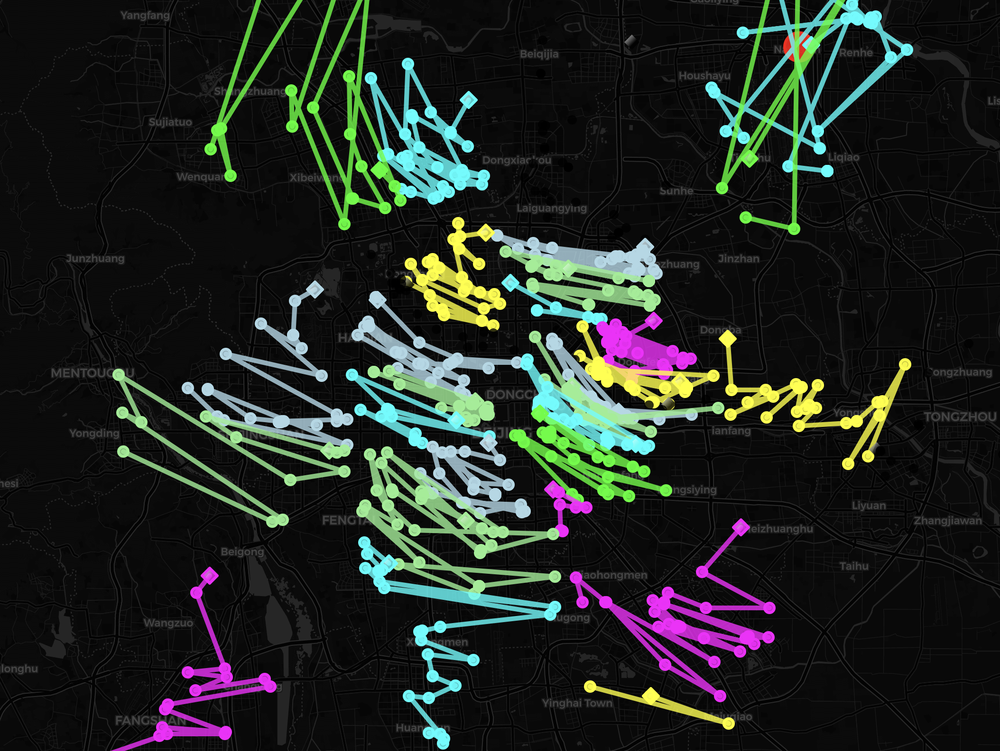
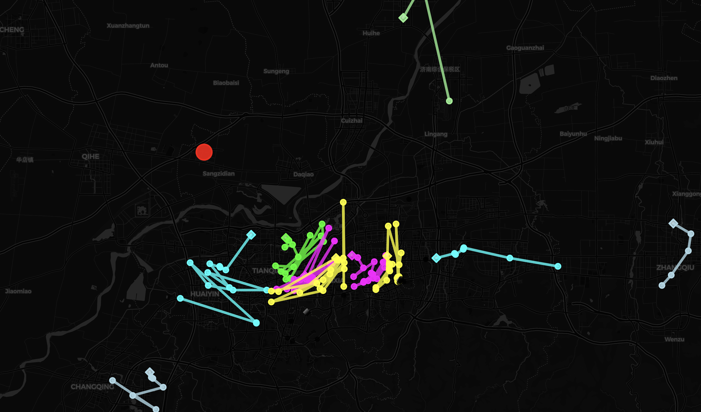
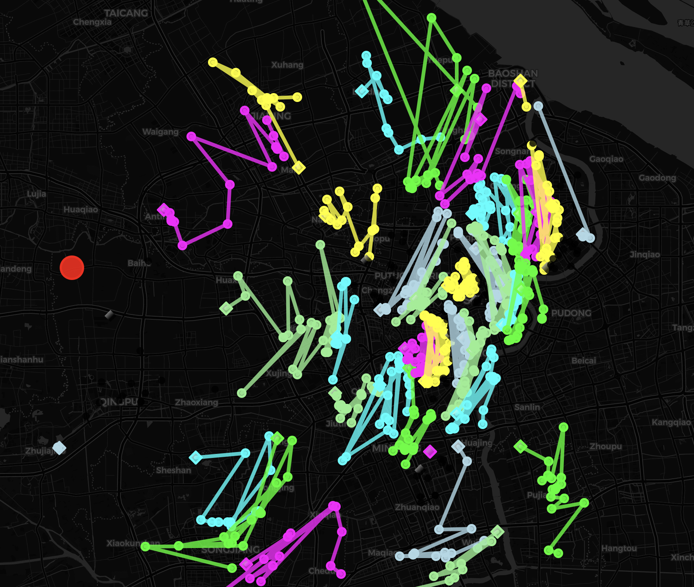

## Report - dijkstra_VRPTW_kmeans model

This report summarizes the weight and volume utilization for a fleet of cars, along with other relevant statistics.

## Summary of Utilization

### File: beijing712.txt

**Total Orders Count:** 713

### Utilization by Car

| Car Number | Weight Utilization (%) | Volume Utilization (%) |
|------------|------------------------|------------------------|
| Car 1      | 99.77                  | 79.36                  |
| Car 2      | 85.59                  | 68.08                  |
| Car 3      | 99.32                  | 79.00                  |
| Car 4      | 11.95                  | 9.51                   |
| Car 5      | 98.59                  | 78.42                  |
| Car 6      | 99.82                  | 79.40                  |
| Car 7      | 96.27                  | 76.57                  |
| Car 8      | 29.64                  | 23.58                  |
| Car 9      | 16.44                  | 13.08                  |
| Car 10     | 73.80                  | 58.70                  |
| Car 11     | 97.12                  | 77.25                  |
| Car 12     | 42.01                  | 33.41                  |
| Car 13     | 99.08                  | 78.81                  |
| Car 14     | 52.70                  | 41.92                  |
| Car 15     | 95.08                  | 75.63                  |
| Car 16     | 22.78                  | 18.12                  |
| Car 17     | 46.51                  | 37.00                  |
| Car 18     | 99.48                  | 79.13                  |
| Car 19     | 96.29                  | 76.60                  |
| Car 20     | 98.73                  | 78.53                  |
| Car 21     | 98.49                  | 78.35                  |
| Car 22     | 48.21                  | 38.35                  |
| Car 23     | 14.95                  | 11.90                  |
| Car 24     | 95.73                  | 76.15                  |
| Car 25     | 99.25                  | 78.95                  |
| Car 26     | 98.81                  | 78.60                  |
| Car 27     | 96.25                  | 76.57                  |
| Car 28     | 98.90                  | 78.67                  |
| Car 29     | 98.66                  | 78.48                  |
| Car 30     | 98.99                  | 78.74                  |
| Car 31     | 23.01                  | 18.30                  |
| Car 32     | 3.82                   | 3.04                   |
| Car 33     | 24.81                  | 19.73                  |
| Car 34     | 98.86                  | 78.64                  |
| Car 35     | 97.06                  | 77.21                  |
| Car 36     | 84.62                  | 67.31                  |

### Averages

- **Average Weight Utilization:** 73.00%
- **Average Volume Utilization:** 58.00%

### Additional Information

- **Total Distance for `beijing712.txt`:** 5880.17 km
- **Total Number of Cars Used:** 36
- **Total Number of single vertex:** 1
- **Classification Mode:** Classify data by K-means with Davies-Bouldin

## Image

---

### File: jinan151.txt

**Total Orders Count:** 151

### Utilization by Car

| Car Number | Weight Utilization (%) | Volume Utilization (%) |
|------------|------------------------|------------------------|
| Car 1      | 98.28                  | 35.25                  |
| Car 2      | 33.08                  | 15.50                  |
| Car 3      | 95.32                  | 31.28                  |
| Car 4      | 93.68                  | 36.57                  |
| Car 5      | 47.00                  | 18.14                  |
| Car 6      | 32.28                  | 9.43                   |
| Car 7      | 20.76                  | 7.03                   |
| Car 8      | 3.40                   | 1.32                   |
| Car 9      | 96.92                  | 33.65                  |
| Car 10     | 99.32                  | 38.55                  |
| Car 11     | 99.60                  | 36.94                  |
| Car 12     | 38.92                  | 13.49                  |
| Car 13     | 56.40                  | 20.57                  |
| Car 14     | 4.00                   | 2.43                   |
| Car 15     | 31.36                  | 11.11                  |

### Averages

- **Average Weight Utilization:** 57.00%
- **Average Volume Utilization:** 21.00%

### Additional Information

- **Total Distance for `jinan151.txt`:** 811.29 km
- **Total Number of Cars Used:** 15
- **Total Number of Single Vertex:** 2
- **Classification Mode:** Classify data by K-means with Davies-Bouldin

## Image

---

### File: shanghai1033_west761.txt

**Total Orders Count:** 761

### Utilization by Car

| Car Number | Weight Utilization (%) | Volume Utilization (%) |
|------------|------------------------|------------------------|
| Car 1      | 92.77                  | 60.55                  |
| Car 2      | 90.10                  | 49.90                  |
| Car 3      | 90.00                  | 49.42                  |
| Car 4      | 94.17                  | 65.81                  |
| Car 5      | 93.27                  | 49.34                  |
| Car 6      | 59.97                  | 34.10                  |
| Car 7      | 92.80                  | 54.12                  |
| Car 8      | 98.13                  | 60.86                  |
| Car 9      | 99.60                  | 54.98                  |
| Car 10     | 11.80                  | 5.98                   |
| Car 11     | 96.87                  | 54.09                  |
| Car 12     | 82.87                  | 43.61                  |
| Car 13     | 96.13                  | 56.05                  |
| Car 14     | 49.43                  | 30.47                  |
| Car 15     | 88.07                  | 51.38                  |
| Car 16     | 90.97                  | 53.31                  |
| Car 17     | 64.97                  | 36.08                  |
| Car 18     | 63.17                  | 36.06                  |
| Car 19     | 75.27                  | 44.63                  |
| Car 20     | 91.63                  | 50.02                  |
| Car 21     | 88.87                  | 52.13                  |
| Car 22     | 93.93                  | 71.00                  |
| Car 23     | 79.03                  | 52.08                  |
| Car 24     | 98.77                  | 52.69                  |
| Car 25     | 82.77                  | 43.09                  |
| Car 26     | 99.83                  | 52.43                  |
| Car 27     | 94.57                  | 67.86                  |
| Car 28     | 80.10                  | 64.62                  |
| Car 29     | 94.63                  | 57.11                  |
| Car 30     | 91.03                  | 56.86                  |
| Car 31     | 92.50                  | 49.81                  |
| Car 32     | 20.60                  | 11.54                  |
| Car 33     | 91.43                  | 46.92                  |
| Car 34     | 16.37                  | 9.07                   |
| Car 35     | 86.90                  | 53.02                  |
| Car 36     | 65.30                  | 41.35                  |
| Car 37     | 88.87                  | 51.80                  |
| Car 38     | 72.40                  | 42.66                  |
| Car 39     | 79.23                  | 46.12                  |
| Car 40     | 75.97                  | 43.50                  |
| Car 41     | 94.97                  | 66.32                  |
| Car 42     | 98.83                  | 54.50                  |
| Car 43     | 95.13                  | 57.86                  |

### Averages

- **Average Weight Utilization:** 81.00%
- **Average Volume Utilization:** 48.00%

### Additional Information

- **Total Distance for `shanghai1033_west761.txt`:** 4766.20 km
- **Total Number of Cars Used:** 43
- **Total Number of Single Vertex:** 1
- **Classification Mode:** Classify data by K-means with Davies-Bouldin

## Image

