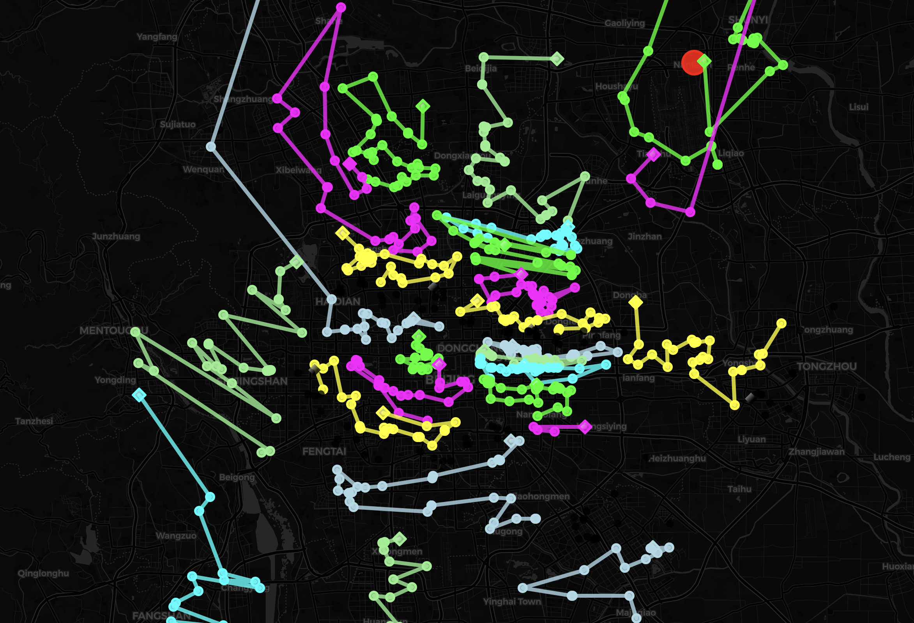
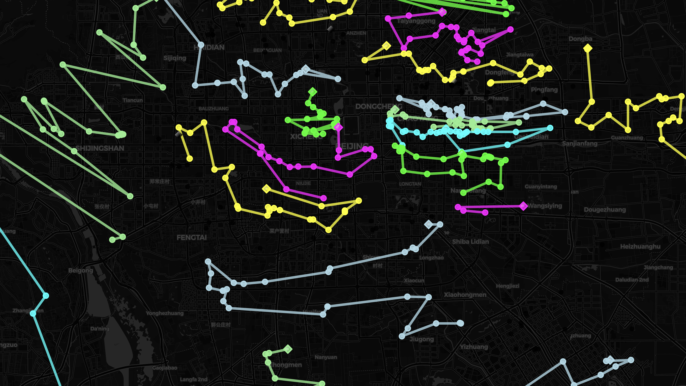
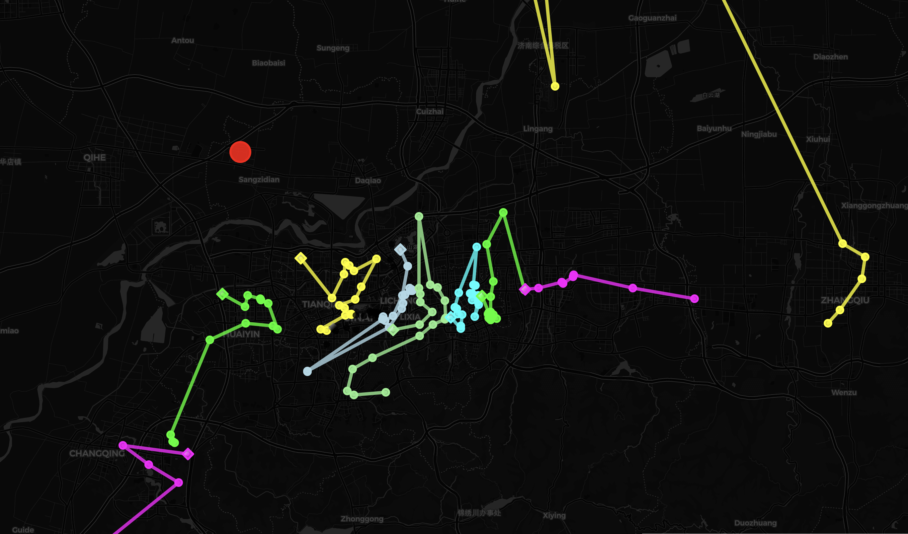
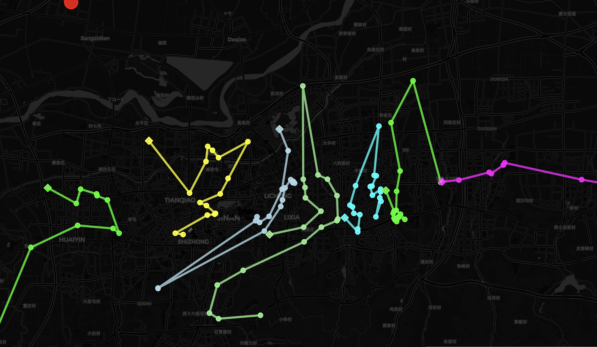
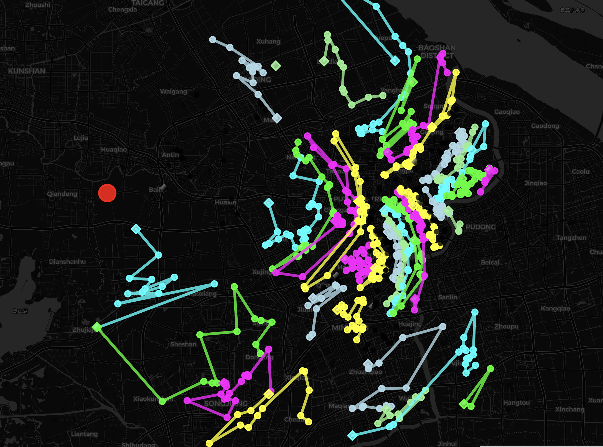
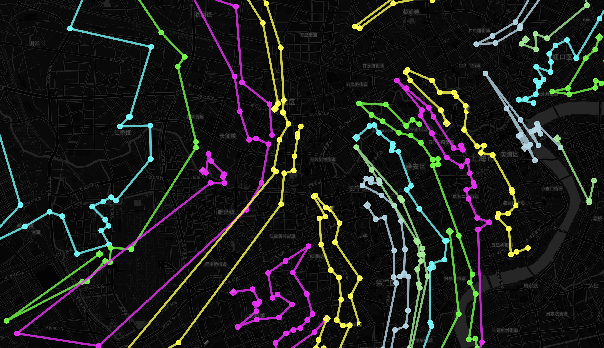

## Report - dijkstra_VRPTW_hierarchical model

This report summarizes the weight and volume utilization for a fleet of cars, along with other relevant statistics.

## Summary of Utilization

### File: beijing712.txt

**Total Orders Count:** 713

### Averages

- **Average Weight Utilization:** 85.00%
- **Average Volume Utilization:** 67.00%

### Additional Information

- **Total Distance for `beijing712.txt`:** 10058.89 km
- **Total Number of Cars Used:** 31
- **Total Number of Single Vertex:** 0
- **Classification Mode:** Classify data by Agglomerative hierarchical clustering

## Image

---

### File: jinan151.txt

**Total Orders Count:** 151

### Averages

- **Average Weight Utilization:** 77.00%
- **Average Volume Utilization:** 28.00%

### Additional Information

- **Total Distance for `jinan151.txt`:** 1959.92 km
- **Total Number of Cars Used:** 11
- **Total Number of Single Vertex:** 0
- **Classification Mode:** Classify data by Agglomerative hierarchical clustering

## Image

---

### File: shanghai1033_west761.txt

**Total Orders Count:** 761

### Averages

- **Average Weight Utilization:** 84.00%
- **Average Volume Utilization:** 50.00%

### Additional Information

- **Total Distance for `shanghai1033_west761.txt`:** 8693.84 km
- **Total Number of Cars Used:** 42
- **Total Number of Single Vertex:** 1
- **Classification Mode:** Classify data by Agglomerative hierarchical clustering

## Image

