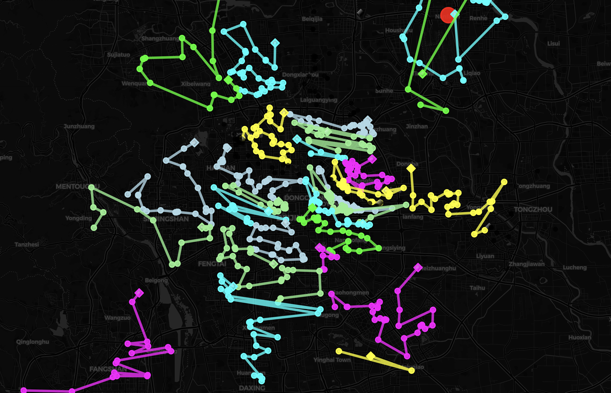
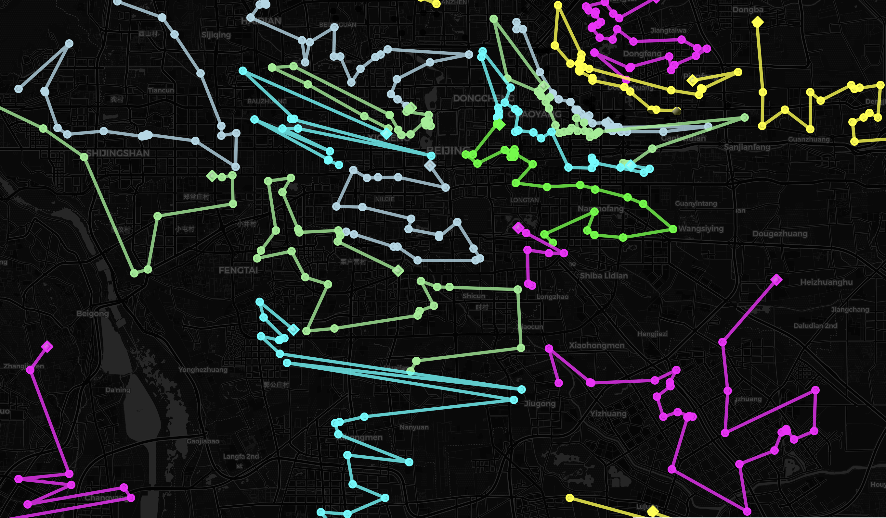
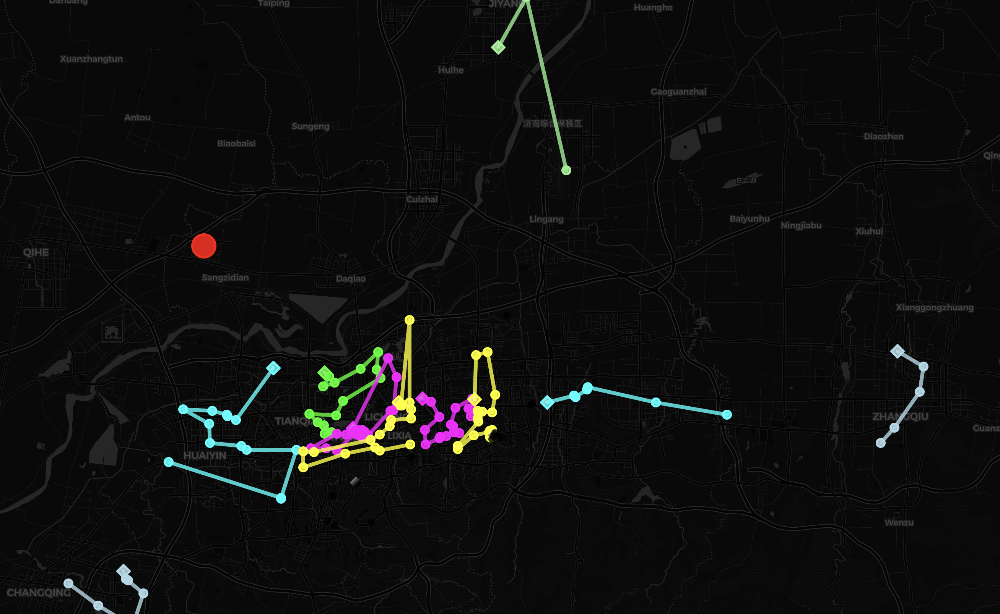
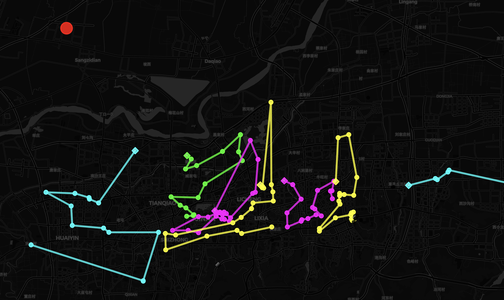
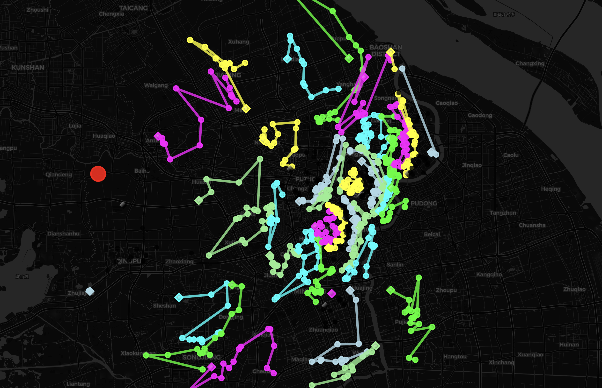
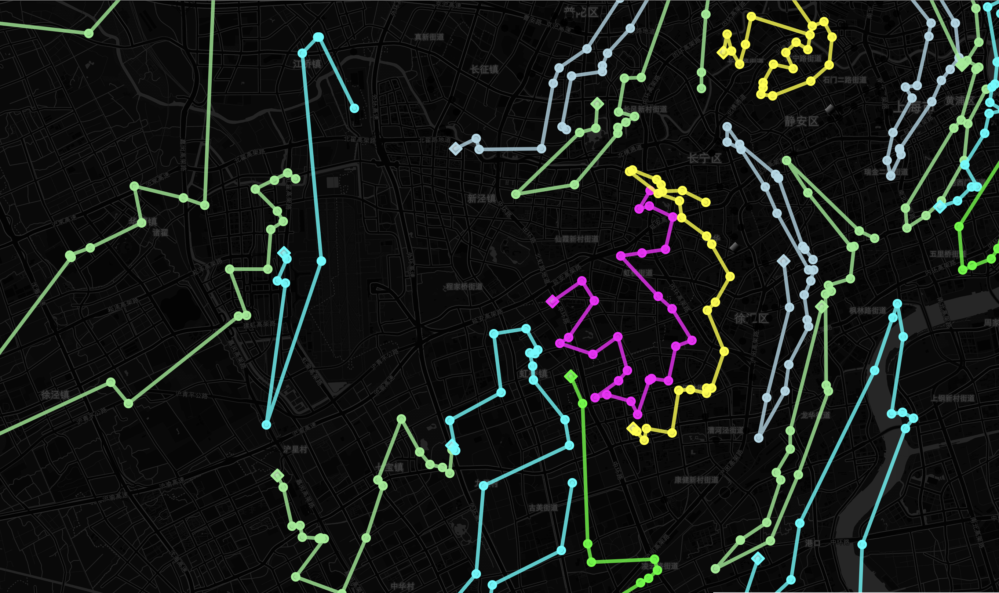

## Report - dijkstra_VRPTW_kmeans model

This report summarizes the weight and volume utilization for a fleet of cars, along with other relevant statistics.

## Summary of Utilization

### File: beijing712.txt

**Total Orders Count:** 713

### Averages

- **Average Weight Utilization:** 73.00%
- **Average Volume Utilization:** 58.00%

### Additional Information

- **Total Distance for `beijing712.txt`:** 5880.17 km
- **Total Number of Cars Used:** 36
- **Total Number of Single Vertex:** 1
- **Classification Mode:** Classify data by K-means with Davies-Bouldin

## Image

---

### File: jinan151.txt

**Total Orders Count:** 151

### Averages

- **Average Weight Utilization:** 57.00%
- **Average Volume Utilization:** 21.00%

### Additional Information

- **Total Distance for `jinan151.txt`:** 811.29 km
- **Total Number of Cars Used:** 15
- **Total Number of Single Vertex:** 2
- **Classification Mode:** Classify data by K-means with Davies-Bouldin

## Image

---

### File: shanghai1033_west761.txt

**Total Orders Count:** 761

### Averages

- **Average Weight Utilization:** 81.00%
- **Average Volume Utilization:** 48.00%

### Additional Information

- **Total Distance for `shanghai1033_west761.txt`:** 4766.20 km
- **Total Number of Cars Used:** 43
- **Total Number of Single Vertex:** 1
- **Classification Mode:** Classify data by K-means with Davies-Bouldin

## Image

